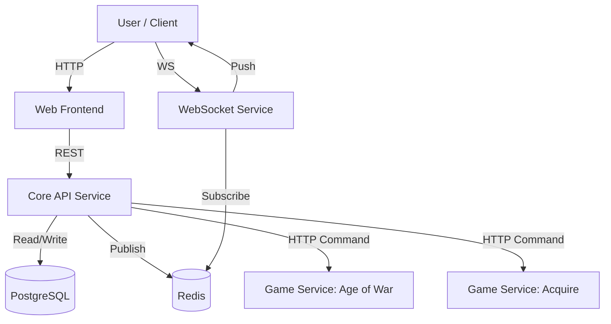

# Architecture

`brdgme` is a platform for playing board games via the web or email, emphasizing accessibility and "lo-fi" ascii-art visuals. The system is built as a set of polyglot microservices orchestrated by Kubernetes.

## System Overview

The architecture follows a microservices pattern where the core logic is centralized in an API service, and each game implementation runs as an independent, stateless service. Real-time updates are handled via a dedicated WebSocket service.

### High-Level Diagram



## Core Components

### 1. API Service (`rust/api`)
**Language:** Rust
**Framework:** Rocket

The heart of the platform. It handles:
- **Authentication**: User management and sessions.
- **Game Orchestration**: Creating games, enforcing turns, and routing commands.
- **Persistence**: Stores game state, logs, and user data in PostgreSQL.
- **Events**: Publishes game updates to Redis for the WebSocket service.

The API communicates with Game Services via HTTP to execute game logic. It effectively acts as a "Game Master," managing the meta-game while delegating rules enforcement to the specific game services.

### 2. WebSocket Service (`websocket`)
**Language:** TypeScript / Node.js
**Dependencies:** Redis

A dedicated service for real-time communication.
- **Role**: Subscribes to channels in Redis (published by the API).
- **Action**: Broadcasts updates to connected clients via WebSockets.
- **Architecture**: Decoupled from the API; it strictly forwards messages, ensuring the API remains stateless regarding active socket connections.

### 3. Web Frontend
**Legacy (`web`):**
- **Language:** TypeScript
- **Framework:** React, Redux, Redux-Saga
- **Build Tool:** Webpack
- **Role**: The primary user interface for the browser.

**Modern (`rust/web`):**
- **Language:** Rust
- **Framework:** Leptos
- **Role**: An experimental or upcoming frontend leveraging WASM and Rust's ecosystem, supporting both Server-Side Rendering (SSR) and Client-Side Hydration.

## Game Services

Each game version is deployed as a standalone microservice. This allows games to be written in different languages and updated independently.

**Interface:**
Every game service exposes a standardized HTTP API (Command Pattern). The Core API sends a "Command" (e.g., "play card") along with the current game state, and the Game Service returns the new state, logs, and updated visualizations.

**Implementations:**
- **Go Games (`brdgme-go`)**:
  - Located in individual directories (e.g., `brdgme-go/age_of_war_1`).
  - Implements the `Gamer` interface defined in `brdgme-go/brdgme`.
  - Wrapped in a CLI/HTTP adapter.
  
- **Rust Games (`rust/game`)**:
  - Located in the Rust workspace (e.g., `rust/game/acquire-1`).
  - Implements the `Gamer` trait defined in `rust/lib/game`.

## Data Flow

1.  **Game Move**:
    - User sends a command (e.g., "roll dice") via the Web Frontend.
    - Frontend makes a POST request to the **API**.
2.  **Processing**:
    - **API** retrieves the current game state from **PostgreSQL**.
    - **API** determines the correct **Game Service** URL.
    - **API** sends the command + state to the **Game Service**.
3.  **Execution**:
    - **Game Service** validates the move and calculates the new state.
    - **Game Service** returns the new state and logs to the **API**.
4.  **Update**:
    - **API** saves the new state to **PostgreSQL**.
    - **API** publishes an update event to **Redis**.
5.  **Broadcast**:
    - **WebSocket Service** receives the event from **Redis**.
    - **WebSocket Service** pushes the update to all connected clients.

## Infrastructure

- **Containerization**: Docker is used to package all services.
- **Orchestration**: Kubernetes (K8s) manages the deployment.
- **Development**: `Skaffold` is used for local development and deployment workflows, automating the build-push-deploy loop.

## Game Interface Contract

Communication between the Core API and individual Game Services is strictly over HTTP using JSON. The API sends a **Request** object and expects a **Response** object.

### Common Structures

**GameResponse**:
```json
{
  "state": "string (serialized internal game state)",
  "points": [0.0, 1.0],
  "status": {
    "Active": { "whose_turn": [0], "eliminated": [] },
    "Finished": { "placings": [0, 1], "stats": [] }
  }
}
```

**Log**:
```json
{
  "content": "string (markup)",
  "at": "timestamp",
  "public": true,
  "to": []
}
```

### Methods

#### 1. New Game (`New`)
Initialize a new game instance.
- **Request**: `{"New": {"players": 2}}`
- **Response**:
  ```json
  {
    "New": {
      "game": GameResponse,
      "logs": [Log],
      "public_render": { "pub_state": "...", "render": "..." },
      "player_renders": [{ "player_state": "...", "render": "...", "command_spec": {} }]
    }
  }
  ```

#### 2. Get Status (`Status`)
Retrieve current status and renders for an existing game state.
- **Request**: `{"Status": {"game": "serialized_state_string"}}`
- **Response**:
  ```json
  {
    "Status": {
      "game": GameResponse,
      "public_render": { ... },
      "player_renders": [ ... ]
    }
  }
  ```

#### 3. Make Move (`Play`)
Execute a player command.
- **Request**:
  ```json
  {
    "Play": {
      "player": 0,
      "command": "play card 1",
      "names": ["Alice", "Bob"],
      "game": "serialized_state_string"
    }
  }
  ```
- **Response**:
  ```json
  {
    "Play": {
      "game": GameResponse,
      "logs": [Log],
      "can_undo": true,
      "remaining_input": "",
      "public_render": { ... },
      "player_renders": [ ... ]
    }
  }
  ```

#### 4. Player Counts (`PlayerCounts`)
Get valid player counts for the game.
- **Request**: `"PlayerCounts"` (string) or `{"PlayerCounts": {}}`
- **Response**: `{"PlayerCounts": {"player_counts": [2, 3, 4]}}`

## Database Schema

The Core API uses PostgreSQL to manage state. Key tables include:

- **`users`**: User identities, credentials, and preferences.
- **`game_versions`**: Metadata about available games (name, version, service URL).
- **`games`**: Active and finished game instances. Stores the serialized `game_state` blob.
- **`game_players`**: links `users` to `games`, storing player-specific state and position.
- **`game_logs`**: Immutable history of all actions and messages within a game.
