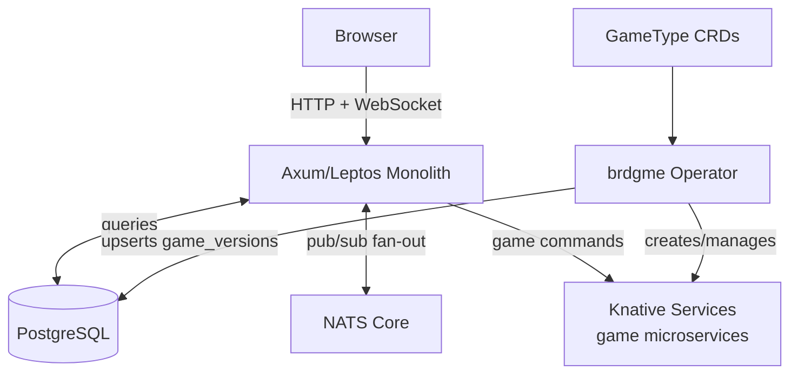
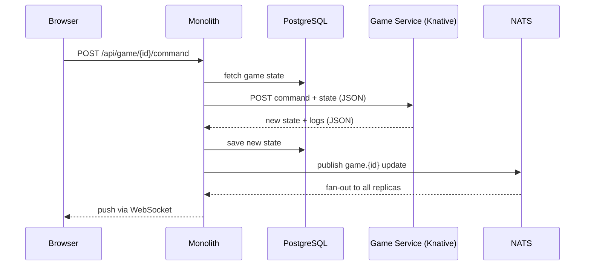

# Architecture

`brdgme` is a platform for playing board games via the web or email, using
lo-fi ASCII rendering and plain text commands.

## System Overview

The platform consists of a small always-on core (the Rust monolith) and
independently deployed game microservices running as Knative Services
(scale-to-zero). The monolith is the only component that communicates with
clients directly.



## Core Components

### Monolith (`rust/web`)

**Language:** Rust
**Framework:** Axum (backend), Leptos (frontend, SSR + WASM hydration)

Handles:
- User authentication and sessions.
- Game orchestration: creating games, enforcing turns, routing commands.
- Real-time WebSocket updates (NATS Core pub/sub for cross-replica fan-out).
- Web frontend served via SSR with client-side WASM hydration.

Runs as multiple replicas. Clients connect via a single load balancer and hold
one WebSocket connection to whichever replica they land on. NATS ensures game
updates published by any replica reach all connected clients for that game.

### Game Services

Each game type is a standalone stateless microservice deployed as a Knative
Service. The monolith communicates with game services via the JSON contract
defined in this document. Knative handles scale-to-zero automatically.

### brdgme Operator (`rust/operator`)

**Language:** Rust
**Framework:** kube-rs

Bridges Kubernetes infrastructure and the application database. The core API
has no knowledge of Kubernetes.

- Watches `GameType` custom resources.
- Creates and manages the corresponding Knative Service for each game type.
- Upserts game metadata into `game_versions` in PostgreSQL.
- Uses Kubernetes Finalizers to guarantee `is_available = false` is written
  to the database before a `GameType` resource is deleted.
- Performs a full reconciliation on startup to recover from state drift.

## Data Flow: Game Move



## Infrastructure

See `docs/VISION.md` for infrastructure choices and rationale.

- **Platform**: DigitalOcean Kubernetes (SYD1)
- **CNI**: Cilium
- **Serverless**: Knative Serving
- **Message bus**: NATS Core (in-cluster)
- **Database**: PostgreSQL
- **Ingress**: Cilium Gateway API

## Game Interface Contract

Communication between the monolith and game services is strictly HTTP/JSON.
The monolith sends a request object; the game service returns a response
object. This contract is stable and must not change.

### Common Structures

**GameResponse:**
```json
{
  "state": "string (serialized internal game state)",
  "points": [0.0, 1.0],
  "status": {
    "Active": { "whose_turn": [0], "eliminated": [] },
    "Finished": { "placings": [0, 1], "stats": [] }
  }
}
```

**Log:**
```json
{
  "content": "string (markup)",
  "at": "timestamp",
  "public": true,
  "to": []
}
```

### Methods

#### New Game

Initialize a new game instance.

- **Request:** `{"New": {"players": 2}}`
- **Response:**
  ```json
  {
    "New": {
      "game": GameResponse,
      "logs": [Log],
      "public_render": { "pub_state": "...", "render": "..." },
      "player_renders": [{ "player_state": "...", "render": "...", "command_spec": {} }]
    }
  }
  ```

#### Get Status

Retrieve current status and renders for an existing game state.

- **Request:** `{"Status": {"game": "serialized_state_string"}}`
- **Response:**
  ```json
  {
    "Status": {
      "game": GameResponse,
      "public_render": { ... },
      "player_renders": [ ... ]
    }
  }
  ```

#### Make Move

Execute a player command.

- **Request:**
  ```json
  {
    "Play": {
      "player": 0,
      "command": "play card 1",
      "names": ["Alice", "Bob"],
      "game": "serialized_state_string"
    }
  }
  ```
- **Response:**
  ```json
  {
    "Play": {
      "game": GameResponse,
      "logs": [Log],
      "can_undo": true,
      "remaining_input": "",
      "public_render": { ... },
      "player_renders": [ ... ]
    }
  }
  ```

#### Player Counts

Get valid player counts for the game type.

- **Request:** `"PlayerCounts"`
- **Response:** `{"PlayerCounts": {"player_counts": [2, 3, 4]}}`

## Database Schema

Key tables in PostgreSQL:

- **`users`**: User identities, credentials, and preferences.
- **`game_versions`**: Available game types. Managed by the operator. Includes
  `is_available` flag for soft-deletion and a unique index on `(name, version)`.
- **`games`**: Active and finished game instances. Stores the serialized
  `game_state` blob.
- **`game_players`**: Links `users` to `games`, storing player position and
  player-specific state.
- **`game_logs`**: Immutable history of all actions and messages within a game.
