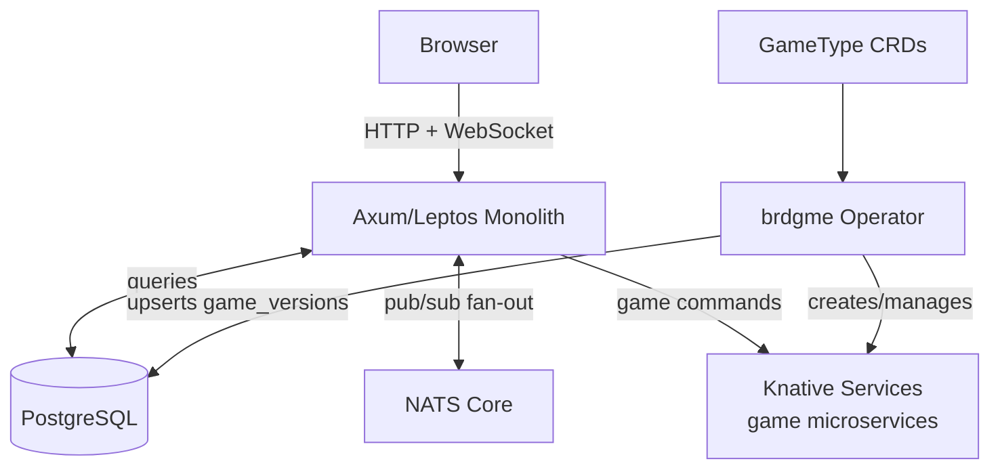

# brdgme Vision

## What brdgme Is

brdgme is a lo-fi multiplayer board gaming platform. Games are played via web
browser or email. All game output is ASCII text with color and basic decoration.
All moves are plain text commands.

Core principles that do not change:

- Play-by-email, not notify-by-email: a full game can be played from an email
  client alone.
- Accessible in network-hostile environments: if you can send and receive email,
  you can play.
- ASCII-first rendering: no images, no canvas, no WebGL.
- Text commands: moves like `play a4` or `buy 3 sackson`.
- Bot support: every game ships with at least one bot implementation.
- Open source: the platform, all dependencies, and all tooling are open source.

## Target Architecture

The target is a small always-on core with serverless game workloads, running on
managed Kubernetes.

### Always-On Core

The Rust monolith (`rust/web`, Axum + Leptos) handles:

- User authentication and sessions.
- Game orchestration: creating games, enforcing turns, routing commands.
- Real-time WebSocket updates.
- Web frontend: server-side rendering with WASM hydration.

The monolith runs as multiple replicas for resilience. WebSocket fan-out across
replicas is handled by NATS Core pub/sub (in-cluster). NATS Core is sufficient
here - persistence is not required, as clients reconnect and fetch full state
on reconnect.

### Serverless Game Services

Each game type runs as a Knative Service (scale-to-zero). The monolith routes
commands to the appropriate service via the JSON contract defined in
`ARCHITECTURE.md`. Game services are stateless: they receive the full game
state per request and return the new state.

Scale-to-zero is appropriate because most game types are inactive at any given
time. The contract is stable and does not change.

### brdgme Kubernetes Operator

A custom Kubernetes operator (Rust, `kube-rs`) manages the lifecycle of game
types without the core API having any knowledge of Kubernetes:

- Watches `GameType` custom resources.
- Creates and manages the corresponding Knative Service.
- Upserts game metadata (name, version, Knative URL) into the `game_versions`
  PostgreSQL table.
- Sets `is_available = false` when a `GameType` is removed, using Kubernetes
  Finalizers to guarantee the database update completes before the resource is
  deleted.
- Performs a full reconciliation on startup to recover from any state drift
  that occurred while the operator was offline.

The `game_versions` table uses a unique index on `(name, version)` and a soft-
delete `is_available` flag to preserve foreign key integrity with game history.

The core API reads `game_versions` from PostgreSQL as it does today. It has no
RBAC permissions and no awareness of the cluster.

## Infrastructure

- **Platform**: DigitalOcean Kubernetes, Sydney region (SYD1).
- **CNI**: Cilium (default on DOKS, no additional setup required).
- **Serverless runtime**: Knative Serving.
- **Database**: PostgreSQL.
- **Message bus**: NATS Core (in-cluster).
- **Ingress**: Cilium Gateway API, single load balancer.

Estimated baseline cost: ~$63/month (3x 2GB nodes + load balancer + PostgreSQL
storage minimum).

## What is Removed

The following legacy services are removed after cutover:

- `rust/api`: Rocket API server (replaced by `rust/web`).
- `web`: React/Redux/Webpack frontend (replaced by Leptos in `rust/web`).
- `websocket`: Node.js WebSocket service (replaced by NATS + monolith).
- Redis: previously required for WebSocket fan-out (replaced by NATS Core).

## Planned Features (Long-Term, Out of Scope for Current Migration)

### Email

- Outbound: game notifications and invitations via a third-party provider
  (Mailgun, Postmark, or similar). No self-hosted SMTP.
- Inbound: play-by-email via provider webhook. The provider receives the reply
  email and POSTs it to a Knative Service endpoint, which parses the command
  and submits it to the game.
- This replaces the legacy Go SMTP service, which had persistent deliverability
  problems.

### Bots

- LLM-based. System prompt: brdgme context + game rules + command grammar.
  User prompt: current game state + available command spec from the game
  service.
- Invoked as a Knative Service (scale-to-zero).
- Constrained generation (grammar-based output) to ensure bot moves always
  produce valid commands.
- Initial implementation: external LLM API (Groq or similar) for fast
  iteration.
- Long-term target: Ollama in-cluster on CPU inference. Latency of 30-60
  seconds per move is acceptable for async turn-based play.
