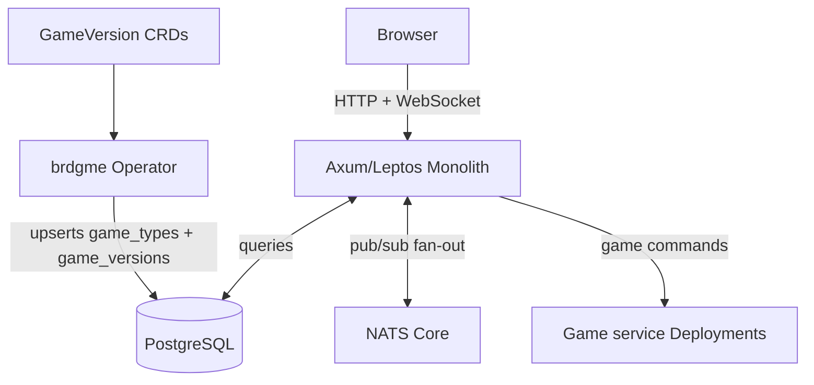

# brdgme Vision

## Documentation Principles

Documentation exists to get a developer or agent productive immediately. Every
sentence must carry information a reader cannot trivially infer from the code.

- No prose for its own sake. No summaries of what the code already says.
- Capture decisions, constraints, and non-obvious behavior only.
- Prefer dense lists over paragraphs.
- A short accurate document is better than a long stale one. Delete freely.

## What brdgme Is

brdgme is a lo-fi multiplayer board gaming platform. Games are played via web
browser or email. All game output is ASCII text with color and basic decoration.
All moves are plain text commands.

Core principles that do not change:

- Play-by-email, not notify-by-email: a full game can be played from an email
  client alone.
- Accessible in network-hostile environments: if you can send and receive email,
  you can play.
- ASCII-first rendering: no images, no canvas, no WebGL.
- Text commands: moves like `play a4` or `buy 3 sackson`.
- Bot support: every game ships with at least one bot implementation.
- Open source: the platform, all dependencies, and all tooling are open source.

## Target Architecture

The target is a small always-on core with serverless game workloads, running on
managed Kubernetes.

### Always-On Core

The Rust monolith (`rust/web`, Axum + Leptos) handles:

- User authentication and sessions.
- Game orchestration: creating games, enforcing turns, routing commands.
- Real-time WebSocket updates.
- Web frontend: server-side rendering with WASM hydration.

The monolith runs as multiple replicas for resilience. WebSocket fan-out across
replicas is handled by NATS Core pub/sub (in-cluster). NATS Core is sufficient
here - persistence is not required, as clients reconnect and fetch full state
on reconnect.

### Game Services

Each game type runs as a plain Kubernetes Deployment + Service, always on.
The monolith routes commands to the appropriate service via the JSON contract
defined in `ARCHITECTURE.md`. Game services are stateless: they receive the
full game state per request and return the new state.

Decided 2026-07-03: no scale-to-zero, no Knative. The idle footprint of ~20
small Go/Rust services (roughly 5-25Mi RSS each) is lower than the resource
requests of the Knative Serving control plane that would scale them to zero,
and turn-based games have no load spikes worth request-based autoscaling.
Knative remains a healthy project; it was dropped for fit, not health. If a
genuinely heavy scale-to-zero workload ever appears (e.g. in-cluster LLM
inference), KEDA with the NATS JetStream scaler is the tool to reach for.
The contract is stable and does not change.

Game services are polyglot by necessity, not by design: the contract is
language-agnostic, and 17 games are currently implemented in Go
(`brdgme-go/`) alongside the Rust ones (`rust/game/`, of which
`lords-of-vegas-1` is not yet deployed). Decided 2026-07-08 (superseding
the 2026-07-02 "Go stays indefinitely" call): the goal is a 100% Rust
project as soon as possible - every Go game is being rewritten as a Rust
`-2` edition (plan #23), after which `brdgme-go/` and the legacy
web/websocket services are deleted (plan #31). Until then Go code gets
light-touch maintenance only. All new games are written in Rust against
the shared `brdgme_game`/`brdgme_markup` libraries.

All Rust games now implement the V2 game interface (2026-07-20): in
addition to the V1 endpoints (Rules, PlayerCounts, New, Status, Play),
V2 games serve DataDocs (field dictionary for the structured YAML
states), BasicStrategy (hard rules against dumb moves), and
AdvancedStrategy (optimal play heuristics). The `game_client` crate
abstracts V1/V2 - callers never check versions. The operator stores
`interface_version` from the GameVersion CRD.

### brdgme Kubernetes Operator

A custom Kubernetes operator (Rust, `kube-rs`) bridges Kubernetes and the
application database without the core API having any knowledge of Kubernetes:

- Watches `GameVersion` custom resources (`gameversions.brdgme.com/v1`).
- Upserts `game_types` and `game_versions` rows in PostgreSQL on reconcile.
- Uses finalizers to guarantee `is_public = false` is written before a resource is deleted.
- `is_deprecated: true` on a CR keeps the service running for in-progress games
  but excludes it from new game creation.

Long-term goal: operator also manages the Deployment + Service lifecycle for
each game version (currently game service manifests are static kustomize
files).

## Infrastructure

- **Platform**: DigitalOcean Kubernetes, Sydney region (SYD1), provisioned
  via OpenTofu (`infra/` - PLAN Phase 21).
- **CNI**: Cilium (default on DOKS, no additional setup required).
- **Database**: PostgreSQL via the CloudNativePG operator; backups + PITR to
  DO Spaces via the Barman Cloud plugin (PLAN Phase 19).
- **Message bus**: NATS (in-cluster, JetStream enabled: at-least-once
  delivery for bot eventing, plain Core pub/sub for WS fan-out).
- **Ingress**: DOKS managed Gateway API (Cilium, pre-installed on >= 1.33
  VPC-native clusters), single auto-provisioned DO load balancer.
- **DNS**: OpenTofu-managed records (`infra/dns.tf`); external-dns (Phase
  20) retired 2026-07-05 - no viable DigitalOcean provider.
- **Secrets**: sealed-secrets - encrypted `SealedSecret` CRs committed to
  the config repo (PLAN Phase 15).
- **Observability**: Grafana Cloud (logs/metrics/traces/alerting) via a
  single in-cluster Alloy agent, plus OTLP-based APM (PLAN Phase 18);
  decided 2026-07-05, superseding VictoriaLogs/vmalert.

### Domain routing

Routing uses a Gateway API `Gateway` with one HTTPS listener per hostname and
one `HTTPRoute` per hostname to the backing Service.

| Domain | Service | Notes |
|---|---|---|
| `brdg.me` | `web` | Leptos monolith Deployment (target 2 replicas) |

Legacy services (`web-legacy`, `api`, `websocket`) were removed pre-cutover
(2026-07-12, rust-only-repo WP1); go-live is a hard cutover from the old
cluster. TLS via cert-manager's Gateway API integration (certificates bound
to Gateway listeners).

Estimated baseline cost: ~$63/month (3x 2GB nodes + load balancer + PostgreSQL
storage minimum).

## What is Removed

The following are removed in sequence:

**In Phase 14 (drop Knative):**
- Knative Serving + Kourier: replaced by plain Deployments and DOKS managed
  Gateway API (see Game Services above for rationale).

**After legacy decommission (Phase 16):**
- `rust/api`: Rocket API server (replaced by `rust/web`).
- `web`: React/Redux/Webpack frontend (replaced by Leptos in `rust/web`).
- `websocket`: Node.js WebSocket service (replaced by Redis pub/sub + monolith).

**After NATS migration (Phase 17):**
- Redis: replaced by NATS Core for WebSocket fan-out.

## Planned Features (Long-Term, Out of Scope for Current Migration)

### Email

Provider decided 2026-07-03: Resend (PLAN Phase 22). No self-hosted SMTP.
Chosen for inbound webhooks on the free tier (3,000/mo combined, 100/day),
an official Rust SDK, and strong hobby/OSS adoption; SES is the fallback
only if sustained volume ever exceeds ~10k/mo.

- Outbound: Resend HTTP API via `resend-rs` - no SMTP anywhere
  (DigitalOcean blocks outbound SMTP ports by default). Dev: log fallback
  when `RESEND_API_KEY` is unset, or a test-mode key in `.env`. Login
  emails first (Phase 22a), then turn notifications (22b).
- Inbound: play-by-email via Resend receiving on `play.brdg.me` → signed
  webhook → monolith parses commands and replies with the updated render.
  Per-player reply tokens authorise senders; From is never trusted alone.
- This replaces the legacy Go SMTP service, which had persistent
  deliverability problems.

### Bots

- LLM-based, structured data prompts (2026-07-20, #43). System prompt:
  persona + game rules + strategy docs + data docs + parser docs. User
  prompt: structured YAML player_state/pub_state (not the full render),
  recent logs, failed commands. Static/dynamic split optimizes KV cache
  reuse.
- Bot configuration in the database (bots, llm_providers, bot_providers
  tables). Each bot is a complete config: model, provider, thinking
  budget, temperature, which strategy docs to include. bot_name is not
  constrained to easy/medium/hard - arbitrary names allowed.
- Provider routing: round-robin within a priority level, failover across
  priorities. Three-layer enable gate (bot + provider + binding).
- Provider credentials encrypted at rest (AES-256-GCM, key from
  BOT_ENCRYPTION_KEY env var).
- Runs as a small always-on Deployment (NATS-triggered; see PLAN Phase 13).
- Constrained generation (grammar-based output) to ensure bot moves always
  produce valid commands.
- Long-term target: Ollama in-cluster on CPU inference. Latency of 30-60
  seconds per move is acceptable for async turn-based play.
- Future: admin GUI for bot config management (add/remove/switch,
  priority failover, shared-priority load balancing, enable/disable).
